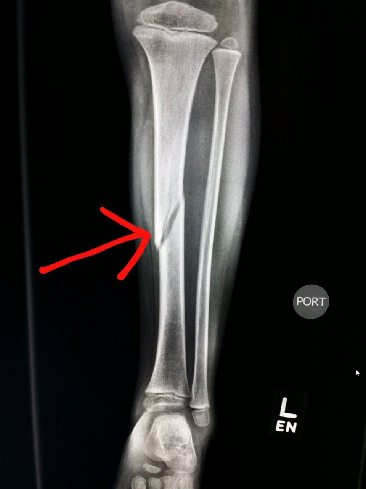
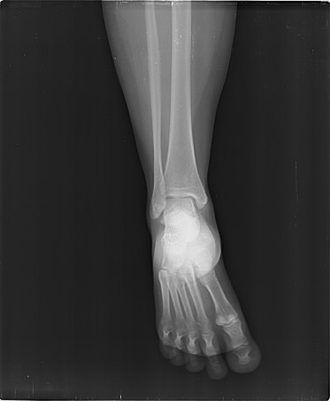

# 🩻 Bone Fracture Detection App

This is a Streamlit web application that uses a machine learning model to detect whether a bone is **fractured** or **not fractured** based on X-ray images.

The app is part of a **supervised learning project** led by **Nadia Urban** at **Shanghai Thomas School**, where students learn how to design, train, and deploy image classification models.

---

## 🎓 Project Overview

This project follows five stages:

1. **Problem Definition** – Detecting bone fractures from X-ray images  
2. **Data Collection** – Gathering a balanced dataset of fractured and healthy bones  
3. **Model Training** – Using Teachable Machine to train a convolutional neural network  
4. **Model Evaluation** – Validating the model’s performance using visual examples  
5. **Web App Deployment** – Designing an interactive and user-friendly Streamlit interface

---

## 🛠️ App Description

The app allows users to upload or capture an X-ray image to determine whether it shows a **fractured** or **not fractured** bone.

### 🧾 Model Information
- **Classes:**  
  1. Fractured  
  2. Not fractured  
- **Goal:** 🎯 Assist users and doctors in detecting fractures via automated image analysis  
- **Data Type:** 🖼️ X-ray images of fractured and healthy bones  
- **Data Source:** 🌐 Online sources including **kaggle.com**  
- **Training:** 🏋️ Trained using **Teachable Machine**  
- **Model Type:** 🧠 Convolutional Neural Network (CNN)

---

## 🖼️ Training Data Samples

| Class         | Image Preview        | Number of Training Images |
|---------------|----------------------|----------------------------|
| Fractured     |     | 4,606 photos               |
| Not fractured |     | 4,640 photos               |

*These sample images are shown in the app sidebar.*

---

## 👩‍🔬 Model Authors

- **徐馨霞 (Joyce Xu)**  
- **叶子铉 (Mika Ye)**  
- **黄紫萱 (Alice Huang)**  
- **吴印瑜 (Iris Wu)**

---

## ✨ Credits

This app was developed as part of the **AI & Machine Learning Program** at **Shanghai Thomas School**, designed and taught by **Nadia Urban**.

---

## Disclamer

This app is created for educational purposes only. It is not a substitute for professional medical diagnosis.

---

## 🚀 Deployment

The app is deployed using [Streamlit Cloud](https://streamlit.io/cloud) and can also be run locally with:

```bash
pip install streamlit tensorflow keras pillow numpy
streamlit run app.py
